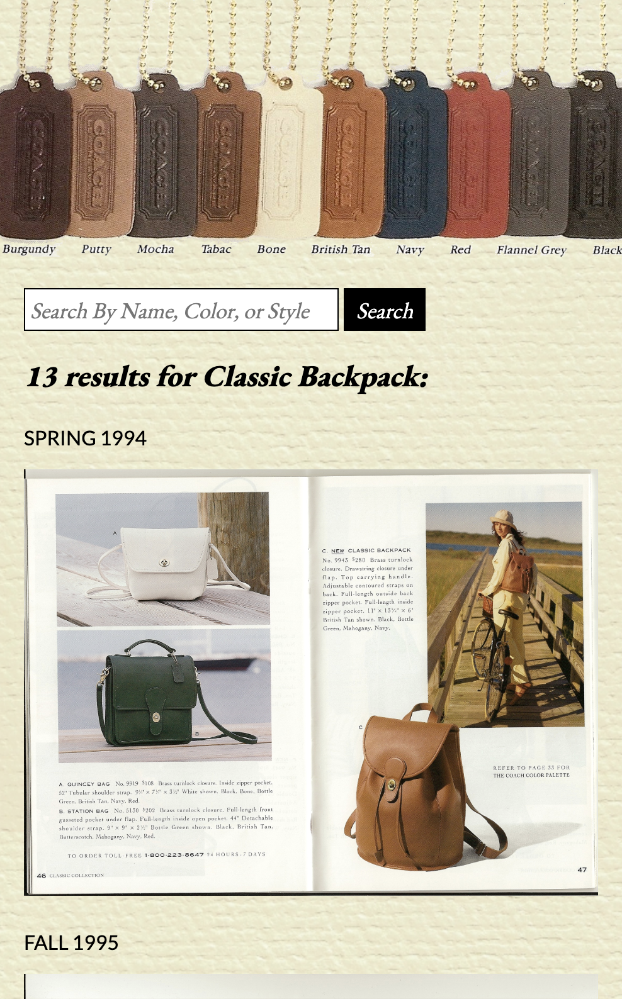

# Coachfinder Pro

An app enabling vintage Coach bag collectors and sellers to search for names, colors, and style numbers, and return the corresponding catalog page.

## Demo

[Live Demo](https://www.jenniferkerssen.com/coachfinderpro/) (Try searching Willis, Sage, or 9921)

## Motivation
Scanned copies of past Coach catalogs are available online, but locating a specific style within those pages is a tedious manual task. My colleague converted those images to text, building a database and searchable API. This app is the interface that enables users to search the text on those pages, and return the corresponding catalog page images.

## Requirements
### UX Requirements
* Pre-load random catalog pages.
* Provide search field and button.
* Display searched term and number of results.
* Render results sequenced by catalog year.
* Render up to 12 results, with a button to render additional results.
* Display error messages for null or no-result searches.

### Technical Requirements 
* Search on and return information from the Coachfinder API.
* Provide links to full size catalog pages.
* Follow a11y best practices.
* Use responsive design and be usable in 320px-wide viewports.

## Built With
* Vanilla JavaScript
* HTML
* CSS
* Custom API by Mary Burford

## Screenshots

